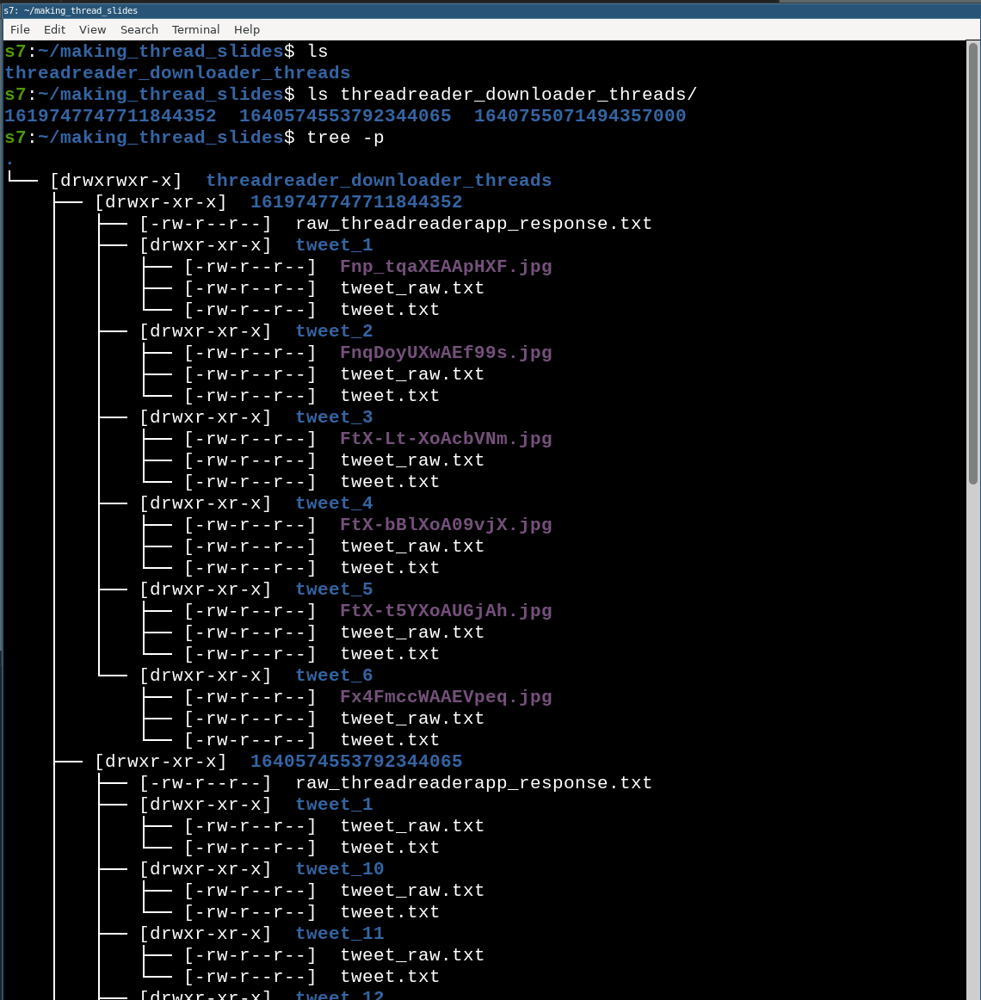
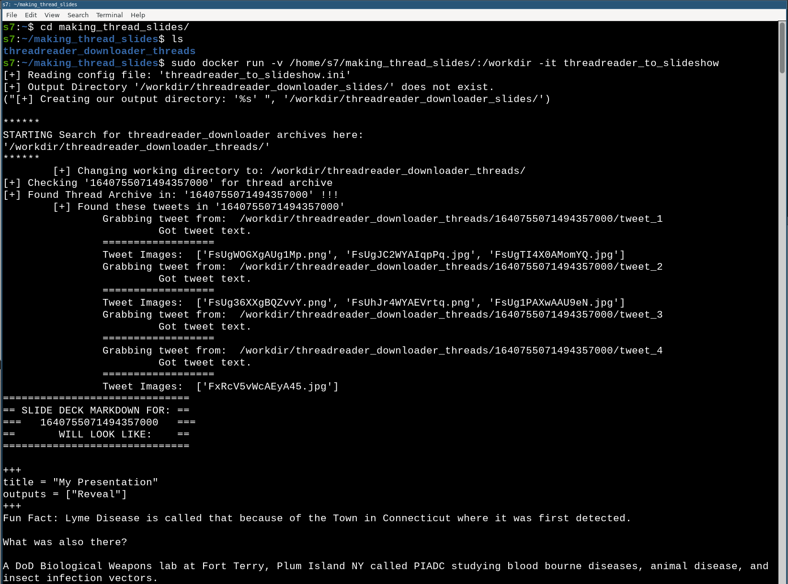
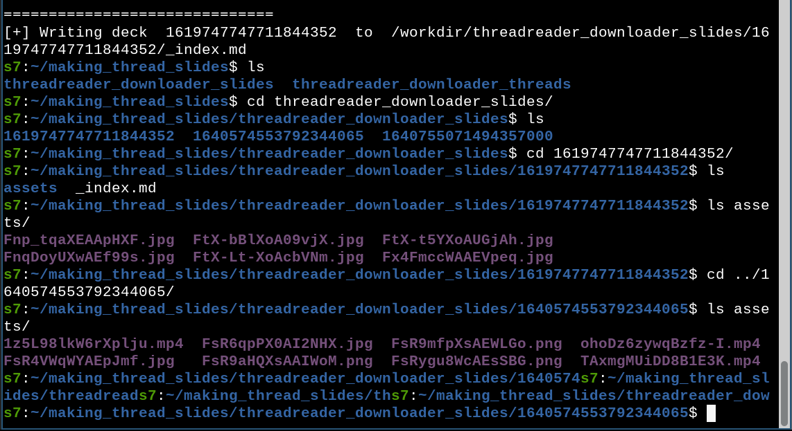

Convert a Twitter thread into an interactive slideshow that can be hosted
on a private site.

This is done be converting a Twitter Thread that's been downloaded with 
["threadreader_downloader"](https://github.com/s7ephen/threadreader_downloader) into Slideshow markdown with each slide as a tweet in the thread containing all its original text and embedded media.

# Examples: 
This was written to create all the slides on: xxxxxxxx.com/xxxxx

# How to use it immediately (Docker):
The simplest way to use this is just to use the Docker container.

1. First download your thread (or threads) into a directory using ["threadreader_downloader"](https://github.com/s7ephen/threadreader_downloader).
2. Create an empty directory on your HostOS. (e.g. mkdir "making_thread_slides")
3. Move your threadreader_downloader downloaded threads directory into this new directory such that the new directory is the parent directory E.G. mv threadreader_downloaded making_thread_slides

4. Make sure whatever your threadreader_downloader directory is named, it is changed to "threadreader_downloader_threads". This is hardcoded in an .ini file in the container, which you are welcome to change, but to use the container out-of-box immediately, use this directory name.

`docker run -v /full/path/to/making_thread_slides/:/workdir -it sa7ori/threadreader_to_slideshow` 

https://asciinema.org/a/eczeFOJQSEzpNcKopOPsemFLk

After the tool has run, you will have a directory called `threadreader_slides` as a child directory to "making_thread_slides" and peer directory to "threadreader_downloader_threads"

This created `threadreader_downloader_slides` directory is now usable in Reveal-Hugo as a slideshow.

# How to use it (on a normal system):
1. copy the `threadreader_to_slideshow.py` out of `/code` and the `.ini` of the same name to wherever you wanna use it.
2. edit the .ini to point to the relevant directories. Keep in mind `threads_dir` conforms to a specfic structure created by threadreader_downloader. The output directory can be any named directory. If the output directory does not exist it will be created.
3. install Python dependencies: apt-get install -y python-requests python-lxml
4. edit the .ini file to change "TESTRUN" variable to "true" if you don't want any directories or files created. leave false to actually create files and such.
4. run `threadreader_to_slideshow.py`

# How to build this Container:
1. Clone this directory
2. cd into the cloned directory.
3. `docker build -t threadreader_to_slideshow .`
